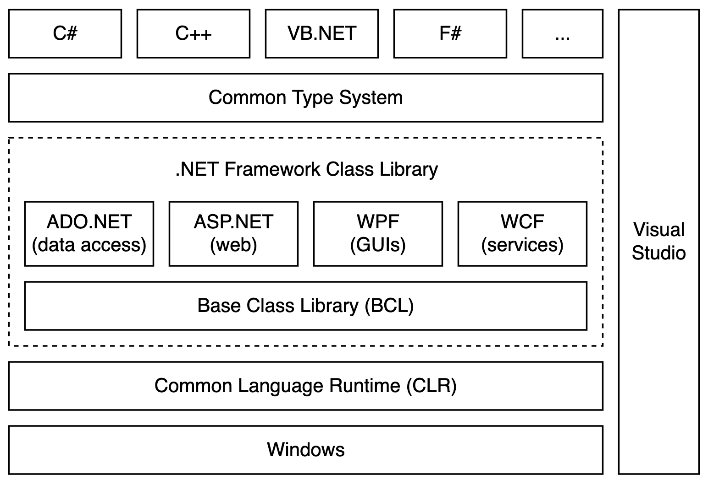
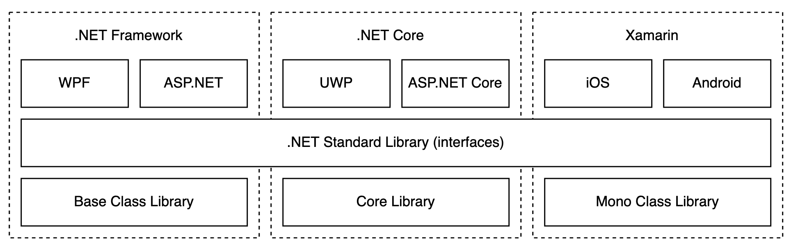
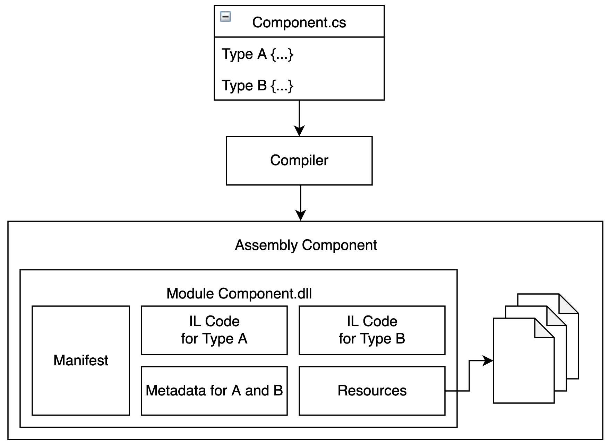
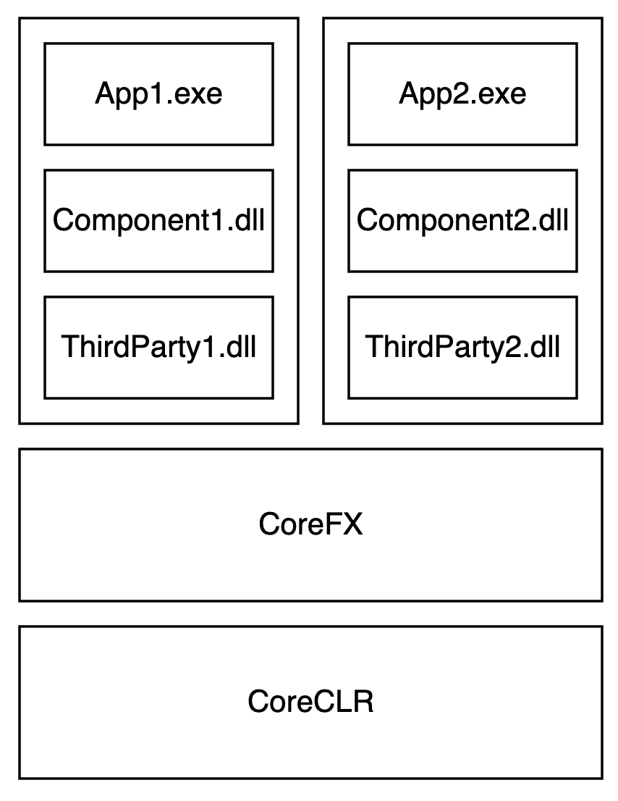
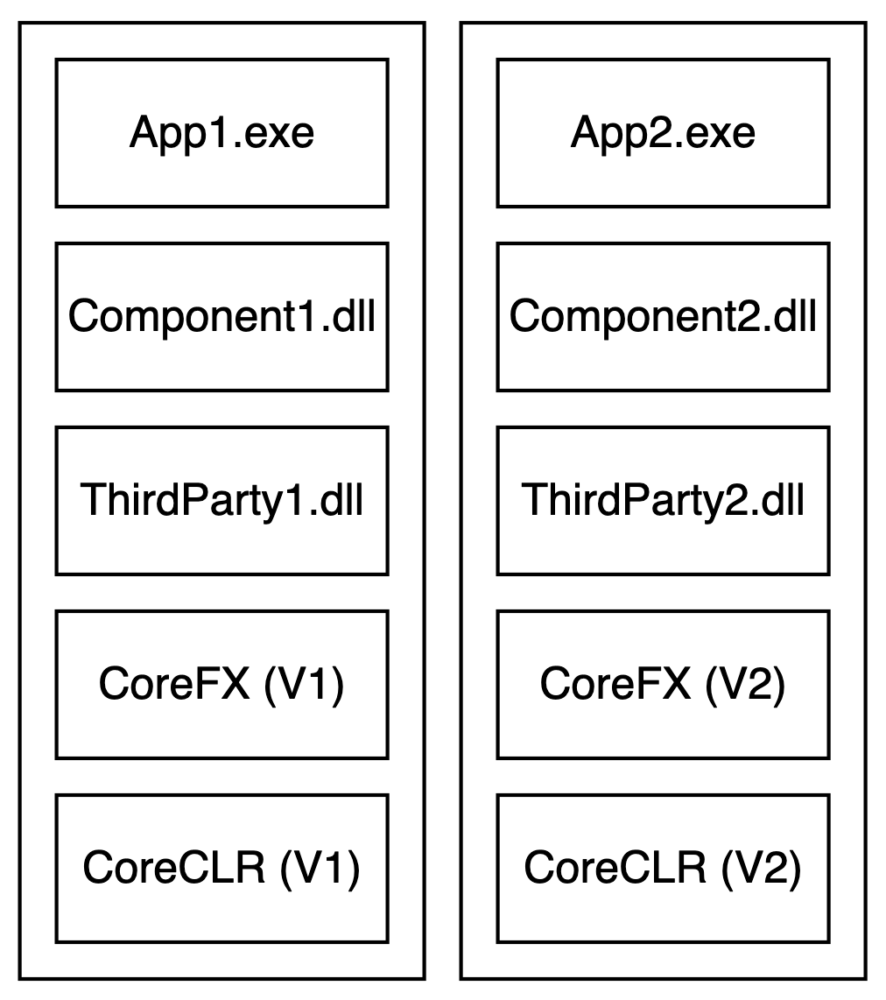
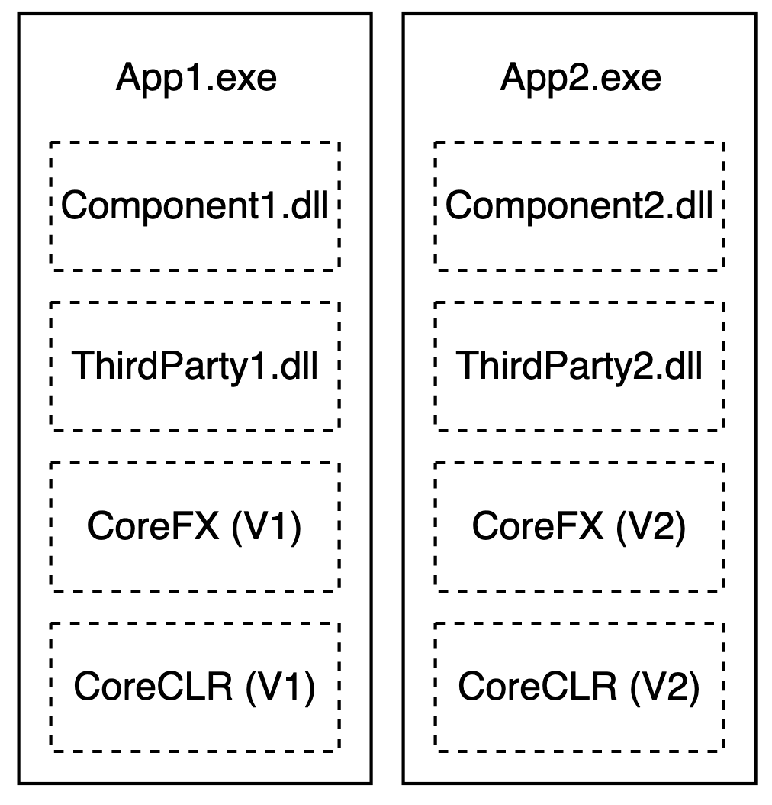

# .NET Architecture

Latest .NET (Full) Framework Version: 4.8 (04/2019)

Latest .NET Core Version: 3.1 (LTS, 12/2019)

Current .NET Version: 5.0 (11/2020) using CoreCLR

# .NET Platform Overview


Each .NET framework implementation consists at least of the Common Language Runtime (CLR) and a class library.

# Implementations of .NET

A .NET app is developed for and runs in one or more implementations.

## .NET (Full) Framework

- until 2019 most stable and comprehensive implementation
- Windows only
- you should move away from it ASAP



## .NET Core

- MIT license
- CoreFX: basis functionality of .NET Framework Library
- CoreCLR: runtime
- for Linux, MacOS X and Windows
- components via NuGet Package Manager
- different deployment types

## Mono

- MIT license
- best when a small runtime is required
- runtime compatible with .NET
- provides a lot of functionalities from the .NET Full Framework
- for Linux, MacOS X and Windows

## Xamarin

- based on Mono
- for native applications on iOS and Android

## .NET 5

- merges Full Framework with .NET Core
- run time: CoreCLR (default), Mono

## Universal Windows Platform

- built on top of .NET Core (not really an own implementation)
- for touch-enabled Windows applications and IoT
- multiple devices (PC, tablet, phone, Xbox)

# .NET Standard

The API specification is implemented by library of a .NET implementation.



Software that is developed under a specific .NET standard does not rely on a specific implementation. Any component binaries that used an implementation that implements the .NET standard can be exchanged with each other.

- The higher the version, the more APIs are available to your library's code.
- The lower the version, the more apps and libraries can use your library.

.NET Framework Compatibility Mode: .NET Standard 2.0

# Common Language Runtime

C# code is compiled into Common Intermediate Language (CIL) code. It is platform independent. The CLR compiles the IL into native machine code (just in time compilation, JIT).

- runs security checks
- memory and error management
- is a virtual machine (processor in software)
- easy code generation (stack machine)
- compilation to native code at compilation time possible with .NET Native on .NET Core

## Advantages
* CPU independent
* OS independent
* language independent -> CLR
* compact code
* optimized code (machine-specific code provided by CLR)

## Comparison to JVM
* CLR always compiles IL code -> JIT-compiler
* JVM interprets byte code

## Components

1. Common Type System
2. Common Intermediate Language (CIL): generated by all .NET compilers and run by CLR
3. Just in Time Compiler (JIT)
4. Virtual Execution System (run time)


# Tiered Compilation
1. when called the first time (fast, non-optimized JIT-compilation -> "Ready to Run", native code at compile time)
1. when called a specific amount (more expensive, optimized JIT-compilation)

# Assemblies

- a .NET program consists of Assemblies (separated installable units, DLL or EXE)
- easy deployment (private, shared, public)
- Assemblies consist of a Manifest (central entry point), one or more modules (IL or native code + metadata) and resources (strings, icons, images, ...)



## Metadata

- information about the data types in an Assembly
- fixed part of the CIL
- access via reflections

## Full Framework: Private Assemblies

- installed by copy (no entries in registry)
- used by one application
- installed in same directory of the application
- Configuration: `Application.exe.config`

## Full Framework: Public (Shared) Assemblies

- assigned a strong name which consists of:
    - name of component
    - public key (company id)
    - culture (language/country e.g. en-US, de-AT)
    - version: <major>.<minor><build><nr>
- installed in Global Assembly Cache (GAC): %windir%/assembly
    - GAC_MSIL: architecture independent
    - GAC_32 / GAC_64: OS architecture
- every application is bound to a specific Assembly version

## File Structure in .NET Core

%ProgramFiles%/dotnet

%ProgramFiles%/store: Runtime Package Store (central location for storing third-party components)

## .NET Core Deployment Strategies

### Framework-dependent Deployment (FDD)

- system-wide installation of .NET Core will be used


**Advantages**

- runs on different .NET installations and platforms
- efficient usage of hard drive

**Disadvantages**

- version needs to be installed on the system
- behavior of CoreFX components can change

```powershell
dotnet publish PrimeCalc.Client --configuration Release --output $pwd/fdd
```

### Framework-dependent Executables (FDE)

- system-wide installation of .NET Core will be used
- executable will be generated based on runtime



**Advantages**

- can be executed directly
- runs on different .NET installations and platform
- efficient usage of hard drive

**Disadvantages**

- version needs to be installed on the system
- behavior of CoreFX components can change

### Self-contained Deployment (SCD)

- application comes with all components (components, third-party components, .NET Core libraries, runtime)

Runtime Identifier Catalog: [https://docs.microsoft.com/en-us/dotnet/core/rid-catalog](https://docs.microsoft.com/en-us/dotnet/core/rid-catalog)



**Advantages**

- full control about used components
- coexistance of multiple runtimes

**Disadvantages**

- waste of hard drive storage
- only runs on runtimes we made the package for

```powershell
dotnet publish PrimeCalc.Client --configuration Release --self-contained --runtime win-x64 --output $pwd/scd-win-x64
dotnet publish PrimeCalc.Client --configuration Release --self-contained --runtime linux-musl-x64 --ouput $pwd/scd-linux-musl-x64
```

### Single-file Executables

- all components in one executable



**Advantages**

- easy deployment
- full control about used components
- coexistance of multiple runtimes

**Disadvantages**

- waste of hard drive storage
- could be less performant

```powershell
dotnet publish PrimeCalc.Client --configuration Release --runtime win-x64 --output $pwd/sfe-win-x64 -p:PublishSingleFile=true -p:PublishTrimmed=true
```
