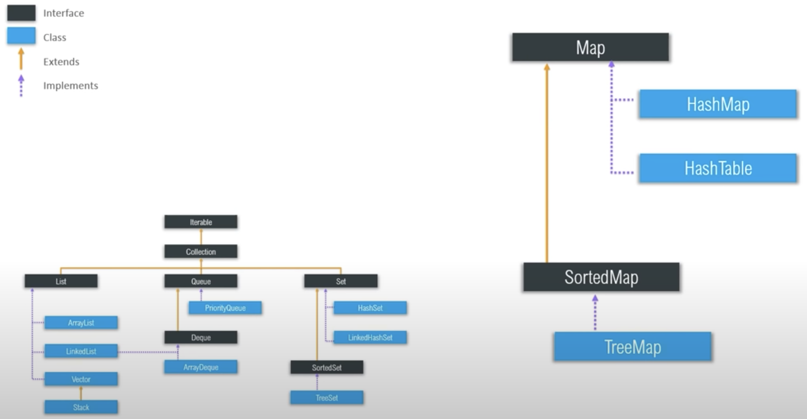

# Java Collection Framework

## Methods of the Collection Interface

- add()
- addAll()
- clear()
- contains()
- containsAll()
- equals()
- hashCode(): returns the hash code value
- isEmpty()
- iterator()
- parallelStream(): returns a parallel stream
- remove()
- removeAll()
- removeIf()
- retainAll(): retains only the elements that are contained in the specified collection
- size()
- spliterator(): creates a Spliterator
- stream(): returns a sequential stream
- toArray()

## ArrayList

Elements can be added and removed dynamically.

## LinkedList

A sequence of links which contains items.

## Vector

Like ArrayList, but synchronized (thread safe). 

## Stack

Last in, first out.

## PriorityQueue

It sorts the data for us.

## ArrayDeque

Data can be inserted at the front and at the back. Can also behave like a queue or a stack.

## HashSet

Contains only unique elements and uses the hashing mechanism to store the elements. The order is unpredictable.

## LinkedHashSet

Contains only unique elements and uses a hash table and a doubly-linked list to store the elements. The order is predictable.

## TreeSet

Contains only unique elements and sorts them in ascending order.

## HashMap

Not synchronized (better for non-threaded applications). One null key and any number of null values allowed.

## LinkedHashMap

Like HashMap, but the order is predictable.

## HashTable

Synchronized. No null keys or values allowed.

## TreeMap

Sorts the map according to the natural ordering of its keys.