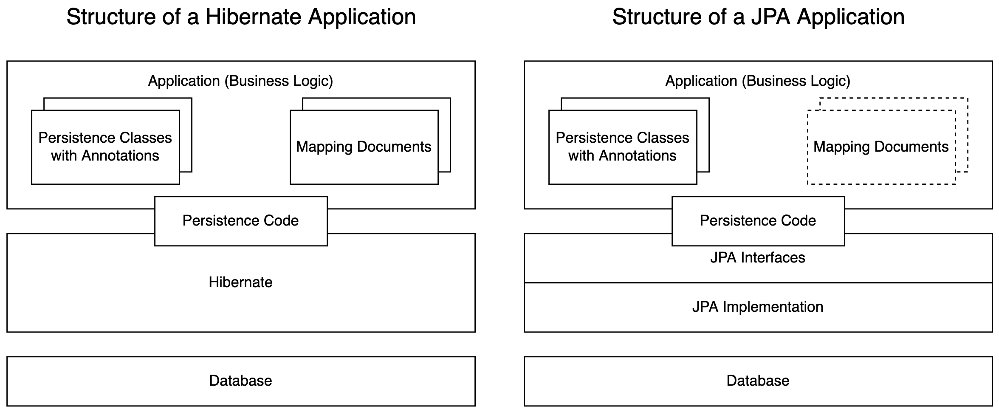
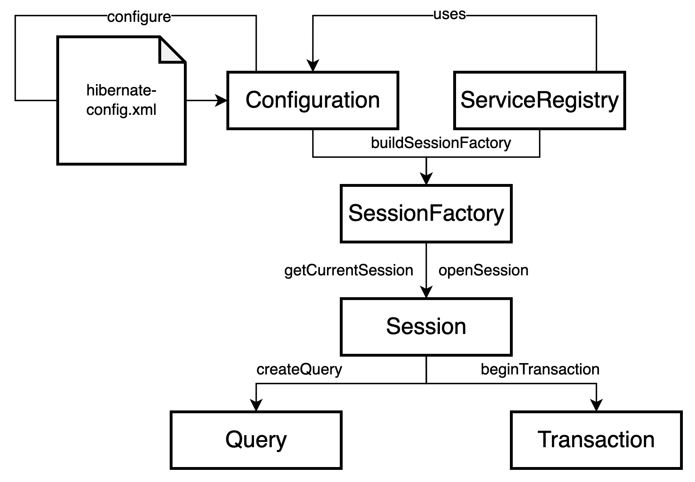
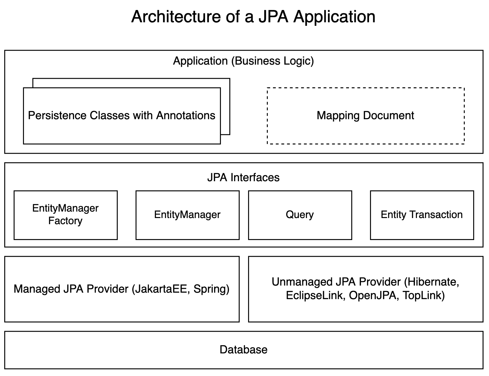

# O/R Mapping
> An O/R mapper maps object oriented classes of an application to the relational model of a database.

An O/R mapper consists of the following components:
* ways to describe the mapping of classes to tables (metadata)
* API for CRUD operations
* query language, embedded into the object model
* transaction handling
* caching strategies

**Advantages**:
* productivity: save JDBC code
* maintainability: less lines of code
* capsulation: persistence layer is separated from rest of the application
* independence of DBMS
* efficiency: ORM developed by database experts

**Disadvantages**:
* efficiency: optimized self-written code is always more efficient
* not suitable for all applications (e.g. when having a lot of bulk updates)

## Paradigm Conflict
### Persistence
Data lives longer than the application so the data needs to be stored on an external medium.
* persist data using the Java class library (IO streams)
  * serialize entire object graphs
  * not everything is needed to be serialized
  * single objects cannot be accessed in byte stream
* persist date using a relational database
  * foundation is the relational algebra
  * sophisticated DBMSs
  * exchange of data between different technologies and platforms
  * standardized query language (SQL)

### Object Orientation vs. Relations
**Granularity**

A relation between an employee and an address can be mapped on a relational model in two ways:
1. two tables where employee has a FK to address
2. one table where all address properties are in the employee table as well (more efficient, costs more memory through NULL entries, some constraints cannot be implemented)

**Inheritance**

There are four ways to map inheritance.
How are polymorph relationships mapped? (e.g. employee can be permanent or temporary)
How are polymorph queries done (SQL does not support this)?

**Identity**

* Java: identity (`a == b`) or equality (`a.equals(b)`)
* relations: primary key
* if the same database entry gets loaded twice, are the Java objects identical or equal?

**Navigation in Object Graph (N -> 1)**

* Java: `project.getManager().getDepartment();`
* relations: 3 SELECTs (project -> employee -> department) or JOIN

**Navigation in Object Graph (1 -> N)**

* Java:
```java
Project proj = loadProject(projIdd);
for (Employee empl : proj.getMembers()) {
  process(empl.getLogbookEntries());
}
```
* relations: JOIN or 1 SELECT (employee) and N SELECTs (LogbookEntry) -> "n+1 selects problem"

**Relationships**

* M:N relationships easy in Java through container with references but needa an additional table in database
## Simple Example with Hibernate and the JPA

Hibernate and JPA applications are very similar. The central component is the persistence manager.
* persistence manager in Hibernate: `Session`
* persistence manager in JPA: `EntityManager`

### Hibernate
#### Mapping Using a Mapping Document
Persistence Ignorance: when looking at the class, you cannot tell if she is being mapped or not
```java
public class Employee {
  private Long id;
  private String lastName;
  public Long getId() { return id; }
  private void setId(Long id) { this.id = id; }
  public String getLastName() { return lastName; }
  public void setLastName(String ln) { this.lastName = ln; }
}
```
```xml
<!DOCTYPE ... "http://../hibernate-mapping-3.0.dtd">
<hibernate-mapping package="swt6.domain">
  <class name="Employee">
    <id name="id" type="long">
      <column name="id"/>
      <generator class="native"/>
    </id>
    <property name="lastName" column="lastName" type="string"/>
  </class>
</hibernate-mapping>
```

#### Mapping Using Annotations
```java
@Entity
public class Employee {
  @Id @GeneratedValue
  private Long id;
  @Column(length=15, nullable=false)
  private String lastName;
  public Long getId() { return id; }
  private void setId(Long id) { this.id = id; }
  public String getLastName() { return lastName; 
  public void setLastName(String ln) { this.lastName = ln; }
}
```

#### Persistence Code
Saving a domain object:
```java
Session session = sessionFactory.openSession();
Transaction tx = session.beginTransaction();
session.save(employee);
tx.commit();
session.close();
```
```sql
INSERT INTO Employee (..., ..., ..., id) VALUES (?, ?, ?, null)
```

Loading domain objects:
```java
Session session = sessionFactory.openSession();
Transaction tx = session.beginTransaction();
List<Employee> emplList = session.createQuery("select e from Employee e", Employee.class).getResultList();
for (Employee e : emplList) System.out.println(e);
tx.commit();
session.close();
```
```sql
SELECT employee.id as id, ... FROM Employee employee
```

Updating a domain object:
```java
Session session = sessionFactory.openSession();
Transaction tx = session.beginTransaction();
Employee empl = (Employee) session.find(Employee.class, emplId);
empl.setFirstName("Hugo");
tx.commit();
session.close();
```
```sql
SELECT employee.id as FROM Employee e WHERE e.id=?
UPDATE Employee lastName=?, dateOfBirth=?, ... WHERE id=?
```
* automatic dirty checking: persistent object will be checked for updates automatically (through difference in byte code)
* when terminating a transaction, all altered objects will be updated in the database

### JPA
#### Mapping of Persistent Classes
```java
@Entity
public class Employee {
  @Id @GeneratedValue
  private Long id;
  @Column(length=15, nullable=false)
  private String lastName;
  public Long getId() { return id; }
  private void setId(Long id) { this.id = id; }
  public String getLastName() { return lastName; 
  public void setLastName(String ln) { this.lastName = ln; }
}
```

#### Persistence Code
Saving a domain object (key is generated by ORM):
```java
EntityManager em = emFactory.createEntityManager();
EntityTransaction tx = em.getTransaction();
tx.begin;
em.persist(employee);
tx.commit();
em.close();
```
```sql
INSERT INTO Employee (lastName, id) VALUES (?, ?) VALUES identity_val_local()
```

Loading domain objects:
```java
EntityManager em = emFactory.createEntityManager();
EntityTransaction tx = em.getTransaction();
tx.begin();
List<Employee> emplList = em.createQuery("select e from Employee e").getResultList();
for (Employee e : emplList) System.out.println(e);
tx.commit();
em.close();
```
```sql
SELECT empl.id AS id, ... FROM Employee empl
```

Updating a domain object:
```java
EntityManager em = emFactory.createEntityManager();
EntityTransaction tx = em.getTransaction();
tx.begin();
Employee empl = em.find(Employee.class, emplId);
empl.setFirstName("Jeff");
tx.commit();
em.close();
```
```sql
SELECT empl.id AS id FROM Employee empl WHERE empl.id=?
UPDATE Employee lastName=?, dateOfBirth=?, ... WHERE id=?
```

## Architecture of Hibernate and the JPA
* the JPA is a standard based on a JSR (Java Specification Request) with multiple implementations
* Hibernate is an open-source ORM framework for Java
* Hibernate supports annotations and APIs of the JPA
* Hiberante has more functionality than the JPA

### Main Components of Hibernate

* interface for configuration of DB connection: `Configuration`
* interface abstracting the database: `SessionFactory`
* interfaces for CRUD operations: `Session`, `Query`, `Transaction`
* interfaces to react on lifecycle events: `Interceptor`, `LoadEventListener`, `PersistEventListener`, ...
* interfaces to exend Hibernate: `UserType`, `IdentifierGenerator`

### Connection of Important Interfaces
Persistence code is only dependent on interfaces using the _Factory Method_ pattern.

* `Configuration`: read configuration parameters and mapping documents
* `ServiceRegistry`: collection of service objects, representing the configuration parameters
* `SessionFactory`: abstraction of a database connection (thread safe)

### Basic Structure of a Hibernate Application
```java
Configuration cfg = new Configuration().configure("hibernate.cfg.xml");
SessionFactory sessionFactory = cfg.buildSessionFactory();
Session session = null;
Transaction tx = null // org.hibernate.Transaction
try {
  session = sessionFactory.openSession();
  tx = session.beginTransaction();
  // persistence code comes here
  tx.commit();
} catch (Exception e) {
  if (tx != null) tx.rollback();
} finally {
  if (session != null) session.close();
}
sessionFactory.close();
```

`hibernate.cfg.xml`
```xml
<?xml version="1.0" encoding="utf-8"?>
<!DOCTYPE ... "http://./hibernate-configuration-3.0.dtd">
<hibernate-configuration>
  <session-factory>
    <property name="hibernate.connection.driver_class">org.apache.derby.jdbc.ClientDriver</property>
    <property name="hibernate.connection.url">jdbc:derby://localhost/WorkLogDb</property>
    <property name="hibernate.dialect">org.hibernate.dialect.DerbyDialect</property>
    <property name="hibernate.hbm2ddl.auto">create</property>
    <mapping resource="swt6/domain/Employee.hbm.xml"/>
  </session-factory>
</hibernate-configuration>
```


### Important Interfaces of the Persistence Manager
|JPA|Hibernate|Purpose|
|:---|:---|:---|
|`javax.persistence`|`org.hibernate`|base namespace|
|`EntityManagerFactory`|`SessionFactory`|heavy-weighted database abstraction|
|`EntityManager`|`Session`|light-weighted execution of persistence operations|
|`EntityTransaction`|`Transaction`|interface, with a concrete transaction API|
|`Query`|`Query`|execution of queries with objects of the domain model|

### Basic Structure of a JPA Application
```java
EntityManagerFactory emFactory = Persistence.createEntityManagerFactory("PersisttenceUnit");
EntityManager em = null;
EntityTransaction tx = null;
try {
  em = emFactory.createEntityManager();
  tx = em.getTransaction();
  tx.begin();
  // persistence code goes here
  tx.commit();
} catch (Exception e) {
  if (tx != null && tx.isActive()) tx.rollback();
} finally {
  if (em != null) em.close();
}
emFactory.close();
```

`persistence.xml`
```xml
<persistence xmlns=...>
  <persistence-unit name="PersistenceUnit">
    <provider>org.hibernate.jpa.HibernatePersistenceProvider</provider>
    <mapping-file>META-INF/orm.xml</mapping-file>
    <class>swt6.domain.Employee</class>
    <properties>
      <property name="javax.persistence.jdbc.driver" value="org.apache.derby.jdbc.ClientDriver"/>
      <property name="javax.persistence.jdbc.url" value="jdbc:derby://localhost/WorkLogDb"/>
      <property name="hibernate.show_sql" value="true"/>
      <property name="hibernate.format_sql" value="true"/>
    </properties>
  </persistence-unit>
</persistence>
```
* one `<persistence-unit>` per database

## Mapping of Persistent Classes to the Database
## Persistence Manager
## Transactions & Caching
